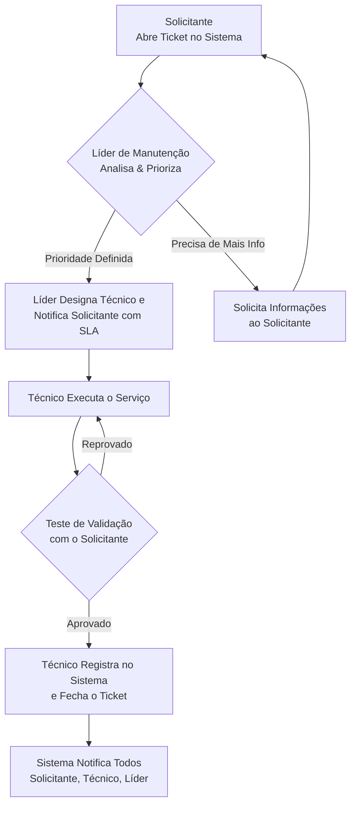

**Objetivo:** Estabelecer um fluxo de trabalho claro e eficiente para a solicitação, execução e registro de serviços de manutenção, garantindo a rápida resolução de problemas, a minimização de tempos de inatividade e a segurança dos colaboradores e ativos.

---

### **1. Formulário de Abertura de Ticket (Solicitação de Serviço)**

Os funcionários (Engenheiros, Técnicos de Campo, Operadores de Linha) podem abrir um ticket de manutenção através dos seguintes métodos:

*   **Método Principal: Formulário Online (Portal de Serviços)**
    *   Acessar o sistema via intranet (link: `manutencao.agro-tech.internal`).
    *   Preencher os campos obrigatórios:
        *   **Nome e Departamento do Solicitante:**
        *   **Localização do Equipamento:** (e.g., Setor de Montagem, Linha 2)
        *   **ID do Ativo/Drone:** (e.g., Drone Modelo X-405, S/N: ATX405-2201)
        *   **Título do Problema:** (e.g., "Motor não inicializa")
        *   **Descrição Detalhada do Problema:** (Incluir sintomas, mensagens de erro no painel, e sob quais condições o problema ocorre).
        *   **Urgência Percebida:** (Alta, Média, Baixa - baseado na tabela de prioridades).
        *   **Anexos:** Fotos ou vídeos do problema são fortemente recomendados.

*   **Métodos Alternativos (Ticket é criado manualmente pela equipe de manutenção):**
    *   **E-mail:** Enviar para `manutencao@agro-tech.com`. O assunto deve seguir o formato: `[Manutenção] - ID do Ativo - Problema Resumido`.
    *   **Comunicação Direta:** Notificar verbalmente o líder de manutenção, que será responsável por abrir o ticket no sistema.

**Dica:** Solicitações sem a ID do Ativo ou uma descrição clara serão devolvidas para complementação das informações, atrasando o início do processo.

---

### **2. Critérios de Priorização**

Após a abertura, o ticket é automaticamente classificado no sistema com base na descrição fornecida. O Líder de Manutenção tem a autoridade final para reclassificar a prioridade.

| Categoria de Prioridade | Tempo de Resposta (SLA) | Tempo de Resolução (SLA) | Exemplos para a Agro-Tech Solutions |
| :--- | :--- | :--- | :--- |
| **ALTA PRIORIDADE**   (Crítico) | **Imediato** < 15 min | **Máx. 4 horas** | • Falha total de uma estação de teste de drones, parando a linha de produção.   • Cheiro de queimado ou faíscas em qualquer equipamento (risco de incêndio).   • Problema de segurança que coloca um operador em risco. |
| **PRIORIDADE MÉDIA**   (Não-Crítico) | **Até 2 horas** | **Máx. 24 horas** | • Drone apresenta falha intermitente em um sensor, mas pode passar pelos testes finais com ressalvas.   • Ferramenta de calibração está desalinhada, reduzindo a eficiência da linha.   • Uma estação de trabalho possui iluminação defeituosa. |
| **BAIXA PRIORIDADE**   (Planejável) | **Até 8 horas** | **Planejado na próxima janela de manutenção** | • Atualização de software rotineira em múltiplos drones.   • Pequena folga em uma bancada de trabalho.   • Troca de lâmpadas de áreas comuns. |

---

### **3. Fluxo de Comunicação**

O fluxo abaixo detalha a comunicação em cada etapa do processo:

**Legenda de Comunicação:**
*   **Notificação Automática do Sistema:** Todas as mudanças de status (aberto, em andamento, aguardando peças, fechado) geram um e-mail automático para o solicitante e a equipe de manutenção.
*   **Comunicação Pessoal:** A validação do teste **deve** ser feita presencialmente ou por chamada de vídeo com o solicitante.

---

### **4. Registro de Serviço (Laudo de Manutenção)**

Após a conclusão do serviço, o técnico **deve** preencher os seguintes campos no ticket do sistema antes de fechá-lo:

*   **Causa Raiz:** Breve descrição da causa provável do problema. (e.g., "Motor queimado devido a sobrecarga elétrica.").
*   **Ação Corretiva Executada:** Descrição clara e concisa do reparo. (e.g., "Substituído o motor do Drone X-405 (S/N: ATX405-2201). Realizada calibração dos parâmetros de voo.").
*   **Tempo Gasto:** Tempo total gasto na diagnose e reparo.
*   **Peças Utilizadas:** Lista de peças substituídas, com números de série e lotes para rastreabilidade.
*   **Tipo de Manutenção:** Classificar como Corretiva, Preventiva ou Preditiva.

**Dica:** O registro é um ativo de conhecimento. Fotos "antes e depois" ou da peça defeituosa devem ser anexadas ao ticket para enriquecer a base de dados históricos.

---

### **5. Acordo de Nível de Serviço (SLA) - Resumo**

| Métrica | Definição | Prazos Estabelecidos |
| :--- | :--- | :--- |
| **Tempo de Resposta** | Tempo entre a abertura do ticket e a primeira ação da equipe de manutenção (atribuição e primeiro contato). | **Alta:** < 15 min   **Média:** < 2 horas   **Baixa:** < 8 horas |
| **Tempo de Resolução** | Tempo total entre a abertura do ticket e a sua resolução final e validação. | **Alta:** < 4 horas   **Média:** < 24 horas   **Baixa:** Planejado |

A gestão da expectativa é crucial. O solicitante será notificado automaticamente sobre o SLA previsto para o seu ticket no momento da priorização.